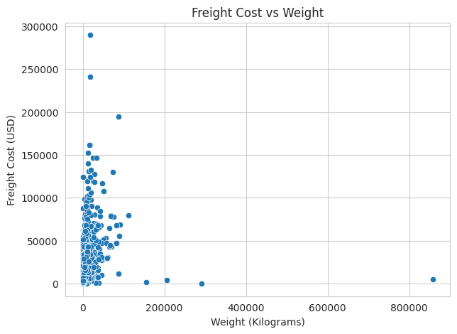
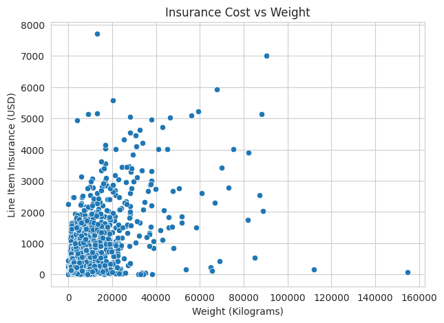
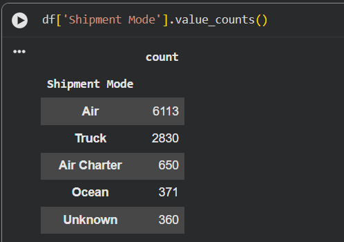

# FedEx Logistics Performance Analysis

## Project Overview

This project performs **Exploratory Data Analysis (EDA)** on logistics shipment data to evaluate delivery performance, shipment costs, and operational patterns.
The analysis focuses on understanding how shipment weight impacts freight and insurance costs, identifying delivery status distribution, and analyzing the most commonly used shipment modes.

The objective is to uncover **operational insights that could help logistics companies improve efficiency, reduce costs, and optimize shipping strategies.**

---

# Dataset Description

The dataset contains shipment-level logistics information including:

* **Shipment Mode** – Transportation method used (Air, Ship, Truck, etc.)
* **Delivery Status** – Shipment delivery outcome
* **Freight Cost** – Transportation cost of shipment
* **Insurance Cost** – Insurance cost associated with shipment
* **Weight (kg)** – Weight of the shipment

These variables allow analysis of **shipping patterns, cost relationships, and delivery outcomes.**

---

# Tools & Technologies

* **Python**
* **Pandas** – Data cleaning and transformation
* **NumPy** – Numerical operations
* **Matplotlib** – Data visualization
* **Seaborn** – Statistical visualizations
* **Jupyter Notebook / Google Colab** – Analysis environment

---

# Key Analysis Performed

The project includes several exploratory analyses:

• Distribution of delivery status across shipments
• Relationship between **freight cost and shipment weight**
• Relationship between **insurance cost and shipment weight**
• Distribution of shipment modes used for logistics operations

These analyses help identify **cost trends, shipping patterns, and operational insights.**

---

# Visualizations

## Delivery Status Distribution



---

## Freight Cost vs Shipment Weight


---

## Insurance Cost vs Shipment Weight



---

## Shipment Mode Distribution



---

# Key Insights

• Most shipments were successfully delivered, indicating overall stable logistics operations.

• Freight cost increases with shipment weight, showing a positive cost-weight relationship.

• Insurance cost also grows with shipment weight but with a slightly weaker relationship compared to freight cost.

• Certain shipment modes dominate logistics operations, indicating preferred transportation channels.

---

# Repository Structure

```
fedex-logistics-performance-analysis
│
├── dataset
│   └── fedex_logistics.csv
│
├── notebook
│   └── fedex_logistics_analysis.ipynb
│
├── visuals
│   ├── delivery_status.png
│   ├── freight_cost_vs_weight.png
│   ├── insurance_cost_vs_weight.png
│   └── shipment_mode_distribution.png
│
└── README.md
---

## Power BI Dashboard

An interactive dashboard was built in Power BI to visualize logistics performance metrics and shipment cost patterns.

The dashboard file can be downloaded here:

powerbi/fedex_logistics_dashboard.pbix

# Author

Ashwin Shende
